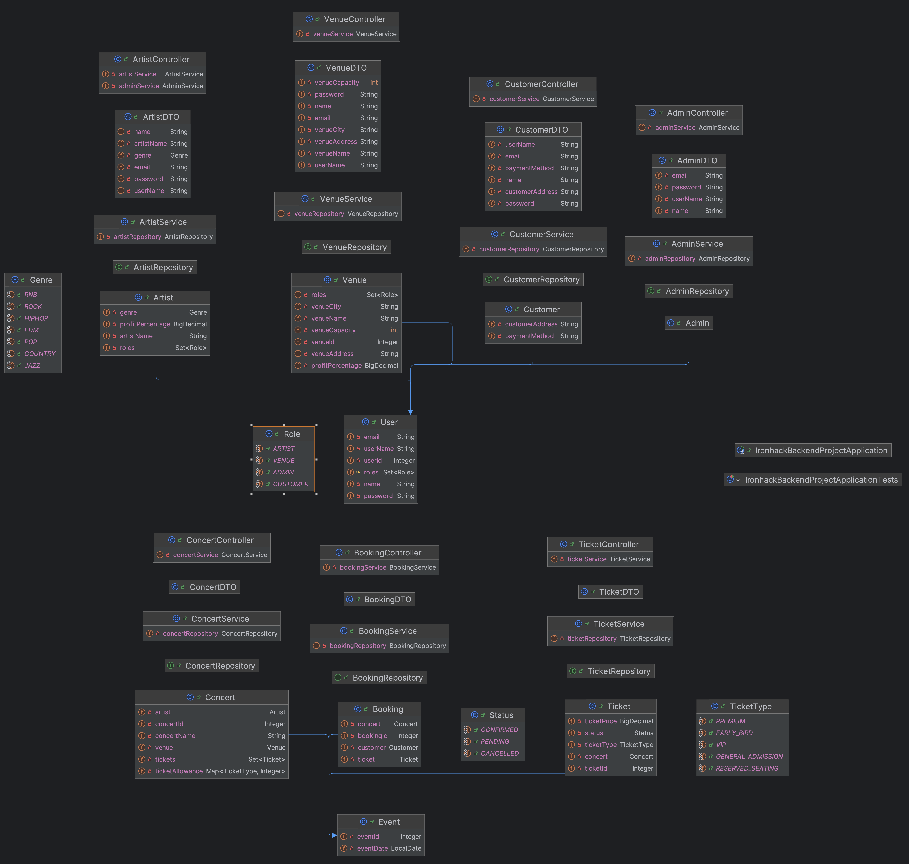

# IronTicket

## Descripción del Proyecto

IronTicket es una aplicación diseñada para la gestión de conciertos. 

Permite a los cuatro tipos de usuarios (admin, customer, artist y venue) interactuar 
de la siguiente manera:

* Admin: Tiene acceso completo a la plataforma y puede gestionar usuarios, eventos, y configuraciones generales.
* Customer: Puede explorar conciertos y artistas, ver qué tipos de tickets hay para cada evento.
* Artist: Puede crear conciertos y gestionar su perfil.
* Venue: Puede crear conciertos y gestionar su perfil. 

La aplicación también permite a los usuarios ver detalles sobre conciertos, artistas y locales, incluyendo 
la asignación de tipo de tickets para cada concierto.

## Diagrama de Clases

## Configuración

* Nombre de la Aplicación: ironhack-backend-project
* Aplicación de Spring Boot
* Base de datos MySQL
* URL de la base de datos: jdbc:mysql://localhost:3306/amazon
* Controlador JDBC para la conexión a la base de datos
* Estrategia DDL: create-drop

## Requisitos del Sistema

* Requisitos de Plataforma:
  * Java 22: El proyecto utiliza Java 22 como versión de Java para ejecutar la aplicación.
  * Spring Boot: Utiliza Spring Boot como framework principal para el desarrollo de aplicaciones web.

* Requisitos de Base de Datos:
  * MySQL: La aplicación utiliza MySQL como sistema de gestión de base de datos relacional.
  * MySQL Connector: Dependencia incluida para la conexión JDBC con MySQL.

* Dependencias Principales:
  * Spring Boot Starter Data JPA
  * Spring Boot Starter Web
  * Spring Boot Starter Validation
  * Spring Boot Starter Security
  * Lombok
  * Java JWT (Auth0)
  * Spring Boot Starter Test y Spring Security Test

## Configuración del Proyecto

Pasos para configurar el entorno de desarrollo local, incluyendo:

1. Clonar el repositorio.
2. Instalar dependencias con `npm install` o `yarn install`.
3. Configurar variables de entorno.

## Tecnologías Utilizadas

- Java 22
- Spring Boot
- Spring Data JPA
- MySQL
- Maven
- Spring Security
- RESTful API
- Git/GitHub

## Estructura de Controladores y Rutas

#### Controladores y Rutas Disponibles

El proyecto utiliza diferentes controladores y rutas para gestionar los recursos disponibles. A continuación se detallan las principales rutas agrupadas por los roles necesarios para acceder a ellas:

## Estructura de Controladores y Rutas

#### Público
- **GET** `/api/concerts/**`: PermitAll
- **POST** `/api/register/**`: PermitAll
- **GET** `/api/artist/**`: PermitAll
- **GET** `/api/venue/**`: PermitAll

#### Admin 
- **GET** `/api/admin/**`: ADMIN
- **PUT** `/api/admin/**`: ADMIN
- **DELETE** `/api/admin/**`: ADMIN
- **DELETE** `/api/user/**`: ADMIN

#### Venue 
- **PUT** `/api/venue/**`: VENUE, ADMIN
- **DELETE** `/api/venue/**`: VENUE, ADMIN

#### Artist 
- **PUT** `/api/artist/**`: ARTIST, ADMIN
- **DELETE** `/api/artist/**`: ARTIST, ADMIN

#### Customer 
- **PUT** `/api/customer/**`: CUSTOMER, ADMIN
- **DELETE** `/api/customer/**`: CUSTOMER, ADMIN

#### Concert 
- **PUT** `/api/concerts/**`: ADMIN, ARTIST, VENUE

#### Otras Solicitudes
Todas las demás solicitudes requieren el rol ADMIN para acceder a recursos protegidos.

## Enlaces Adicionales

- [Enlace a Trello](https://trello.com/invite/b/8ZoxUt4o/ATTI1702f311c40e38c627486c56589b4faeA859BA84/ironhack-project)
- [Presentación del Proyecto](https://docs.google.com/presentation/d/e/2PACX-1vTCK_cTwi1rh7FLlKzYqnkf0O5sU68Ukpgw8_mNQZVSnBtGnQWqynI0gl2EOAnm-61N0ecKsNjGZPYd/pub?start=false&loop=false&delayms=5000&slide=id.p)
- [Repositorio en Github](https://github.com/lourdescastellet/ironhack-backend-project)

## Trabajo Futuro

- Creación y gestión de bookings y sus tickets.

## Recursos

- Ironhack Student Portal
- Lisa
- Stack Overflow

## Miembros del Equipo

- Lourdes Castellet Serra (@lourdescastellet en Github) 

